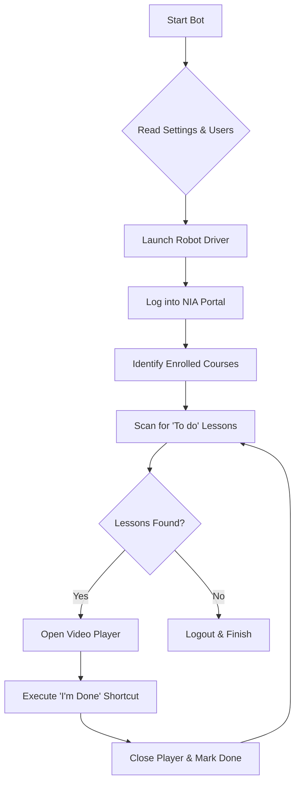

# 🤖 How the NIA-AutoWatch-Bot Works

## _A Simple Guide for Everyone_

Have you ever wondered how a bit of code can "watch" videos for you? While the script might look like a wall of complex text, it actually follows a very simple logic—similar to how you would do it manually, just much faster!

---

## 🗺️ The Big Picture: An Analogy

Imagine you have a **Robot Assistant**. You give this robot a list of usernames and passwords. Here is what the robot does:

1.  **Opens the Door**: It opens a browser (like Chrome) and goes to the login page.
2.  **Logs In**: It types in the username and password from your list.
3.  **Finds the Work**: It looks at the dashboard to see which courses you are enrolled in.
4.  **Checks the To-Do List**: It enters each course and looks for any videos that aren't marked as "Done."
5.  **Plays the Video**: It clicks on the video to start it.
6.  **The "Magic" Shortcut**: Instead of sitting there for 30 minutes, the robot tells the website: _"Hey, I've finished watching this!"_ using a secret handshake (called an API).
7.  **Moves On**: It closes that video and starts the next one until everything is green!

---

## 🛠️ Key Components (In Plan English)

| Technical Term           | What it actually is...                                                                                                                                        |
| :----------------------- | :------------------------------------------------------------------------------------------------------------------------------------------------------------ |
| **Selenium / WebDriver** | The **"Robot Driver"**. It's the technology that allows the code to control a real Chrome browser window.                                                     |
| **`users.csv`**          | Your **"Keyring"**. A simple Excel-like file where you store the logins for all the people who need their courses finished.                                   |
| **`settings.xml`**       | The **"Remote Control"**. A file where you can change how the robot behaves (e.g., "Go super fast" or "Be quiet/mute").                                       |
| **SCORM API**            | The **"Secret Handshake"**. Most online training uses a system called SCORM to track progress. Our bot talks directly to this system to say "Task Completed." |
| **Parallelism**          | **"Multi-tasking"**. The bot can open 5 browser windows at once, finishing 5 people's courses at the same time!                                               |

---

## 🔄 The Technical Flow (Step-by-Step)

---

## 💡 Frequently Asked Questions

### Is it safe?

The bot uses a real browser, so to the website, it looks like a person is logged in. However, because it finishes videos instantly, it's very obvious that automation is being used if someone looks at the logs!

### Why does it look so complex?

The "complexity" in the code isn't for the clicking—it's for **handling mistakes**.

- What if the internet cuts out?
- What if the login fails?
- What if a popup appears?
  Most of the code is there to make sure the robot doesn't get confused and crash if something unexpected happens.

### Can I run it for 10 people at once?

Yes! In the `settings.xml` file, you can change `SimultaneousUsers`. If you set it to `5`, the bot will open 5 separate browsers and work on 5 accounts at the same time.

---

> [!TIP]
> **Pro Tip**: If you want to see what the robot is doing, make sure `Headless` is set to `false` in your settings. This way, you can watch the browser windows open and close automatically!

---

_Documentation generated for the Automation Watch Project._
